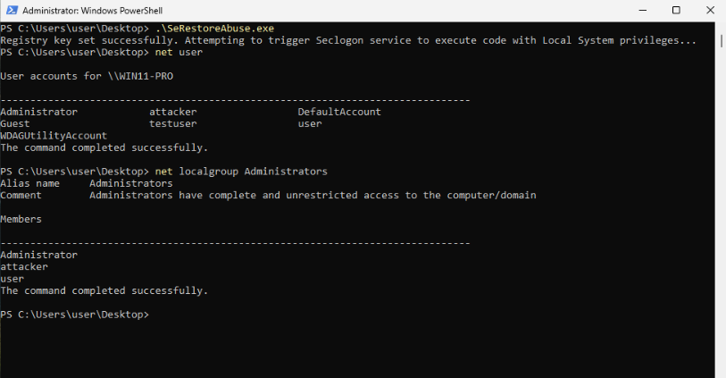

# SeRestoreAbuse Exploit Modification

This is a modified version of @xct_de's SecLogon exploit (https://github.com/xct/SeRestoreAbuse).

## Table of Contents

- [Demo](#demo)
- [Prerequisites](#prerequisites)
- [Tested On](#tested-on)
- [Usage](#usage)
- [Build](#build)
- [Original Implementation](#original-implementation)
- [Current Implementation](#current-implementation)
  - [Code Smell](#code-smell)
  - [Functional Changes](#functional-changes)

<br>

## Demo

**1. Initial state — confirm `SeRestorePrivilege` is present:**


<br>

**2. Running the exploit:**



**Note:** The `seclogon` service is triggered to start by calling the Win32 API function, CreateProcessWithLogonW(). If the service is already running, it will not start and not run the executable w/ SYSTEM priv - i.e. the exploit will not run. `seclogon` is manual start by default and restarting the computer and then calling either the same `SeRestoreAbuse.exe` program or `runas` (with a cmd like `runas /user:any whoami`) will start the program and execute the privilege escalation exploit.

<br>

**3. End state — `attacker` user created with password `password123` and added to Administrators**

## Prerequisites

The running user must hold `SeRestorePrivilege`. Verify with:
```cmd
whoami /priv
```
The `seclogon` service must not be disabled (it defaults to **Manual** start on Windows).

<br>

## Tested On

Windows 10 Pro and Windows 11 Pro w/ Windows Defender and no AV/EDR.

<br>

## Usage

Run the compiled executable from an account that holds `SeRestorePrivilege`:

```cmd
SeRestoreAbuse.exe
```

On success, a local user `attacker` with password `password123` is added to the **Administrators** group and the `seclogon` `ImagePath` is restored to its default value.

<br>

## Original Implementation

### Description

The exploit works by using the user's SeRestorePrivilege (enabled or not) to update `seclogon`'s registry key in order to run malicious script as `SYSTEM`.

The original implementation allowed the user's command line arguments to be entered into the seclogon (a secondary logon service that is always running on Windows). The program would then run the following command which would restart the service:
```PowerShell
powershell -ep bypass -enc ZwBlAHQALQBzAGUAcgB2AGkAYwBlACAAcwBlAGMAbABvAGcAbwBuACAAfAAgAHMAdABhAHIAdAAtAHMAZQByAHYAaQBjAGUA
```

<br>

Which, when decoded, is translated to:
```PowerShell
get-service seclogon | start-service
```

<br>

### Limitations

When I tested this on a Windows 11 Pro workstation, the program did update the registry key's `ImagePath` data but when `seclogon` was restarted, the service control manager (SCM) wasn't able to finish running the command. For instance, when running:
```cmd
cmd /c "whoami > C:\yeet.txt"
```

<br>

The file would be created but not filled. And when creating a user using different variations of the command below, they were not successfully created. It's possible that this was due to my environment and is a race condition for the exploit.
```cmd
cmd /c "net user /add attacker password123"
```

<br>

## Current Implementation

The current implementation does a couple of things differently.

### Code Smell

1. The language was changed from C++ to C.
1. The runtime library was changed to /MT and /MTd for Release and Debug versions, respectively. This allows for execution on systems that do not have Visual Studio dlls.
1. Each API call will print status information to the screen on failure in both Release and Debug builds.

<br>

### Functional Changes

1. On success, the `ImagePath` will be reset follow command completion. This will allow `seclogon` to run normally after the program is done.
1. The service is started using a Win32 API call to CreateProcessWithLogonW(), which triggers the seclogon service to start if it hasn't already.
1. The program does not take command line arguments. It will create a user, `attacker` with a password, `password123` regardless of command line arguments used. These commands are run as SYSTEM and can be customized by modifying `COMMAND_1` and `COMMAND_2` at the top of `SeRestoreAbuse.c`.

<br>

## Build

Open `SeRestoreAbuse.sln` in Visual Studio and build the **Release** or **Debug** configuration for **x64**. The Release build uses `/MT` (static CRT), producing a standalone executable with no Visual Studio DLL dependencies.

To customize the commands run as SYSTEM, edit `COMMAND_1` and `COMMAND_2` at the top of `SeRestoreAbuse.c` before building.

<br>

**NOTE:** If there is a user named `FakeUser` with password `Password`, a command instance might get created!

**End of file**
